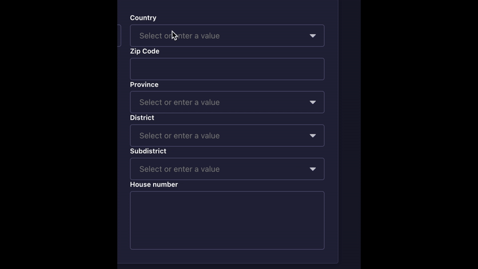

# Strapi Plugin: Address Selection

**Address Selection** is a custom field plugin for Strapi (v5 and above) that provides an intuitive and user-friendly address form generator. With this plugin, users can input detailed address fields, and the form intelligently validates and filters entries based on the selected zip code.

## ✨ Features

- **Custom Address Fields**: Includes fields for country, zip code, province, district, subdistrict, and house number.
- **Smart Filtering**: Automatically displays only the provinces, districts, and subdistricts matching the entered zip code.
- **Seamless Integration**: Works as a custom field in Strapi, making it easy to add to your content types.
- **Developer-Friendly**: Fully compatible with Strapi's ecosystem and customizable as per project needs.

> **Note**: This plugin currently supports addresses in **Thailand** only. Feel free to fork the repository to customize it for other countries or contribute to expand its capabilities.

## ⚙️ Requirements

- **Strapi Version**: `>=5.0.0`
- **Node.js Version**: `>=14.x`

## 🔧Installation

```bash
# Using npm
npm install strapi-plugin-address-selection
```

## 🧩 Configuration

You can customize the behavior of the Address Selection plugin by modifying its configuration file located at:

```
./config/plugins.js
```

Example:

```javascript
module.exports = {
  'address-selection': {
    enabled: true,
    config: {
      // Add custom configurations if required
    },
  },
};
```

## 📮 Usage

1. **Add the Custom Field**:

   - Go to the desired Content-Type Builder.
   - Add a new field and select the "Address Selection" custom field.
   - Configure the field settings as needed.

2. **Save and Use**: Save the content type, and the address form will now be available in your entry forms.

## ⚡️ How It Works

1. **Zip Code Validation**:

   - When a zip code is entered, the plugin fetches the corresponding provinces, districts, and subdistricts dynamically.
   - Non-matching options are automatically filtered out.

2. **Address Form Fields**:
   - Country (https://github.com/annexare/Countries)
   - Zip Code (triggers filtering logic)
   - Province (filtered by zip code)
   - District (filtered by zip code)
   - Subdistrict (filtered by zip code)
   - House Number

## 📸 Screenshots

<p align="center">
    
</p>
<p align="center">
    
</p>

## 🧨 Troubleshooting

If you encounter any issues:

1. Ensure the plugin is correctly installed and activated.
2. Verify that your Strapi version is `5.0.0` or higher.
3. Check the console or Strapi logs for error messages.
4. Submit an issue on the [GitHub repository](https://github.com/telio-s/strapi-plugin-address-selection/issues).

## 🚀Contribution

Contributions are welcome! Feel free to submit a pull request or open an issue to suggest features or report bugs.

## 🔖License

This project is licensed under the MIT License.
